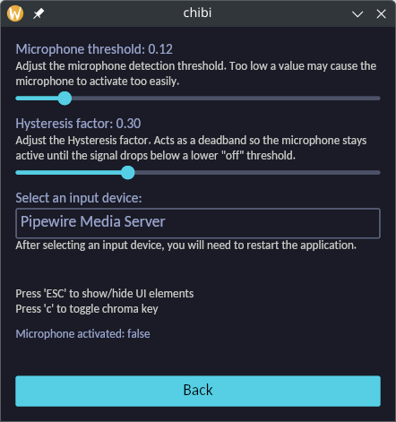

  <h1 align="center">chibi</h1>
  

Indie <a href="https://en.wikipedia.org/wiki/PNGTuber#:~:text=PNGTubers">PNG-tuber</a> application made in Rust supporting all major platforms.
  

  

  

  

## Usage
1. Place your images in `assets`, named as `1.png` and `2.png` (see example)
2. Optionally customize the microphone threshold to get the best result
3. Hide the UI using Escape so you are ready to stream!

## Screenshots
<table>
  <tr>
    <td></td>
    <td></td>
  </tr>
</table>

## Attribution
The example assets used in this application are created by @chereverie
- Twitter: @mewdokas
- Tumblr: chereverie
- Instagram: chereverie.art
